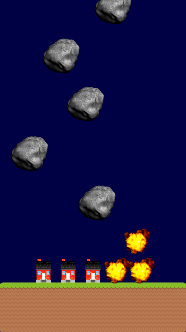
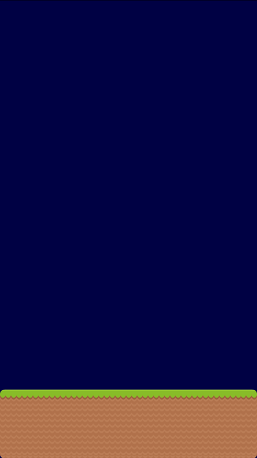
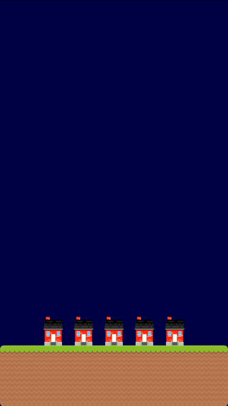
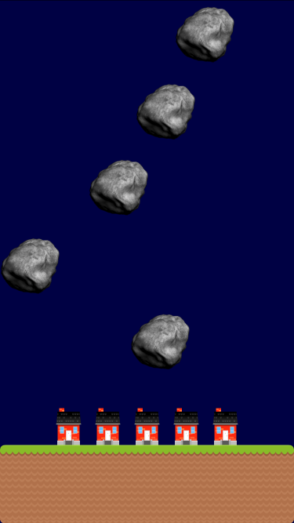
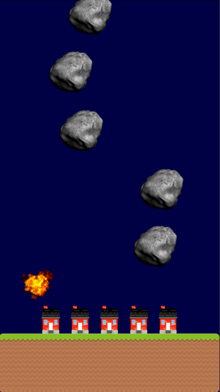

# Imagine Engine Tutorial #1: Asteroid Blaster

Welcome to the first Imagine Engine tutorial, which aims to give you an introduction to the engine and how to build games using it.

In this tutorial, we're going to build a simple game called *Asteroid Blaster*, in which the player has to destroy asteroids by tapping/clicking them. The end result will look like this:



## Setup

To code along this tutorial, start by cloning the Imagine Engine repo to your machine, if you haven't done so already:

```
git clone https://github.com/JohnSundell/ImagineEngine.git
```

Then open the playground workspace for this tutorial, which contains Imagine Engine as well as the graphics that we'll be using:

```
open ImagineEngine/Documentation/Tutorials/1-AsteroidBlaster/AsteroidBlaster.xcworkspace
```

You should now have an empty playground open. Hit ⌘+B to compile Imagine Engine for iOS.

Ready? Let's make a game! 🚀

## Setting the scene

Imagine Engine games consist of one or more scenes that contain all of your game's content. A scene can be a level, a start screen, an options menu, etc. Only a single scene is active and running at the same time. In this tutorial, we'll only have a single scene that contains our entire game.

To create a scene, we'll start by importing `ImagineEngine` and creating a subclass of `Scene` called `AsteroidBlasterScene`, like this:

```swift
import ImagineEngine

class AsteroidBlasterScene: Scene {

}
```

Next, let's set the background color of our scene to a dark shade of blue. We'll do that, along with all of the other setup of our game, in our scene's `setup` method. Imagine Engine automatically calls this method whenever our scene is created or reset, so it's the ideal place to set a scene's initial state.

```swift
class AsteroidBlasterScene: Scene {
    override func setup() {
        backgroundColor = Color(red: 0, green: 0, blue: 0.3, alpha: 1)
    }
}
```

We'll soon start filling our scene with content, but first, let's attach it to a game and start rendering it in our playground's `liveView`. To do that, we create an instance of `AsteroidBlasterScene` (we'll just use the size of an iPhone 6-8 for now) and pass it to a `GameViewController`, which we in turn assign as the playground's `liveView`:

```
let sceneSize = Size(width: 375, height: 667)
let scene = AsteroidBlasterScene(size: sceneSize)
PlaygroundPage.current.liveView = GameViewController(scene: scene)
```

If you open the playground's assistant editor (press ⌥+⌘+Enter) you should now see a dark blue rectangle rendered in the playground's live view. That means that we now have a bare bones game up and running! 👍

## Laying the ground work

With the setup done, let's start adding some content to our game! The first thing we'll add is the ground that will be rendered at the bottom of our scene. To do that we'll use the `Block` type, which lets us render a collection of images as one continuously tiled block.

If you look in the playground's Project Navigator (reveal it by pressing ⌘+1), there's a `Resources` folder that contains a `Ground` folder. That folder contains all of the textures needed to render our block, so all we have to do is to tell Imagine Engine that we want to use that folder as our block's `textureCollection`. Let's add our ground block by adding the following code to our scene's `setup` method:

```swift
let groundSize = Size(width: size.width, height: 100)
let ground = Block(size: groundSize, textureCollectionName: "Ground")
add(ground)
```

When you add the above, you'll see a block being rendered at the upper-left corner of the scene. But that's not where we want it to be, so let's position it at the bottom of the scene instead:

```swift
ground.position.x = center.x
ground.position.y = size.height - groundSize.height / 2
```

All Imagine Engine objects are positioned based on their center point, so to place the block horizontally at the center of the scene, we simply use the scene's own center point. You should now see the ground being rendered correctly at the bottom, like this:



*The cool thing about blocks, is that they can be resized to any size, and their textures will be automatically tiled to fit that new size. That means that you can easily experiment with different block sizes in your games without having to create new images for their textures. For example, try changing the height of `groundSize` to another value, and you'll see the ground block scale nicely accordingly.*

## Adding houses

Before we start adding asteroids and explosion effects, let's add a handful of houses that the player will need to protect. For this we'll use the `Actor` type. Actors are what you'll use for all active objects in your game, that can be animated, collide with others, etc.

To add 5 houses around the horizontal center of our scene, we'll use Swift's `stride()` API to add a house every 50 points. For each house, we'll initialize an `Actor` and assign an animation to it. Just like how we used the `Ground` folder for our ground block, we'll point the actor's animation to the `House` resource folder - and Imagine Engine will automatically load the right texture.

We also associate each house with a `Group` that we call `Houses`. We'll use this group later to perform collision detection between a house and an asteroid.

Here's the code that adds our houses (which we'll put in the `setup()` method, just below the code that adds our ground block):

```swift
let housesGroup = Group.name("Houses")

for x in stride(from: center.x - 100, to: center.x + 150, by: 50) {
    let house = Actor()
    house.group = housesGroup
    house.animation = Animation(name: "House", frameCount: 1, frameDuration: 0)
    add(house)

    house.position.x = x
    house.position.y = ground.rect.minY - house.size.height / 2
}
```

*Note that we wait to assign the position of each house until we have added it to our scene. This is because an actor's animation won't be started until it has been added to a scene, so before that its size will be zero.*

Here's what our scene looks like with houses added:



## Creating asteroids

Now that we have ground and houses, let's start creating some asteroids that the player must destroy before they reach the houses.

We want to create a new asteroid every 2 seconds, at a random X coordinate. We then want to move the asteroid downwards until it either reaches the ground or collides with a house, at which point we want to make it explode.

To register delayed or repeated events, we'll use our scene's `timeline`. Rather than using `DispatchQueue` or `Timer`, in an Imagine Engine game it's recommended to use the `Timeline` API. This enables the engine to batch multiple events together for optimal performance, and to have your delayed or repeated code executed in sync with the engine's own updates. Let's start by creating a new asteroid actor every 2 seconds:

```swift
timeline.repeat(withInterval: 2) { [weak self] in
    guard let scene = self else {
        return
    }

    let asteroid = Actor()
    asteroid.animation = Animation(name: "Asteroid", frameCount: 1, frameDuration: 0)
    scene.add(asteroid)
}
```

This will simply add each asteroid at the top-left corner of our scene. To position it randomly, let's use `arc4random()` to generate a random X value (constrained by the size of the scene minus the size of the asteroid), like this:

```swift
let positionRange = scene.size.width - asteroid.size.width
let randomPosition = Metric(arc4random() % UInt32(positionRange))
asteroid.position.x = asteroid.size.width / 2 + randomPosition
```

Next, let's get those asteroids moving. To do that, we'll simply assign a vertical `velocity` to each asteroid, which will make it continuously move downwards in the scene:

```swift
asteroid.velocity.dy = 100
```

You'll now start seeing asteroids falling from the sky 🌠:



## Collisions

Right now, each asteroid will keep falling indefinitely, even if it hits the ground or a house. To fix that, let's add some collision detection. Collisions are a core part of most games, but doing collision detection in a performant and nice way can sometimes be very tricky. Thankfully, Imagine Engine provides a super easy to use API for observing many types of collisions.

For our game, we want to add two collisions. The first, is when an asteroid collides with our ground block, at which point we want to destroy and remove the asteroid. To handle such a collision, let's observe the `collidedWithAnyBlock` event on each asteroid, like this:

```swift
asteroid.events.collidedWithAnyBlock.observe { asteroid in
    // An asteroid collided with our ground block
}
```

The above code uses Imagine Engine's event API, which enables you to observe many kinds of events on your objects. Similarly, we can add an observation on the event that gets triggered every time an asteroid collides with an actor in the `Houses` group that we defined earlier:

```swift
asteroid.events.collided(withActorInGroup: housesGroup).observe {
    // An asteroid collided with a house
}
```

## Explosions

Now that we have started observing collisions, let's add some explosions 💥! To enable any actor in our game to easily be exploded, let's create an extension that adds an `explode` method. In the implementation of that method, we'll remove all velocity from the actor, then tell it to play an `Explosion` animation, and once it's done we'll remove it.

Finally, we'll return an `AnimationToken`, which is what Imagine Engine gives you back every time you perform an action. This enables you to easily chain multiple actions together and observe whenever an action was completed (more details on that in upcoming tutorials).

Here's the implementation of `explode()`:

```swift
extension Actor {
    @discardableResult func explode() -> ActionToken {
        velocity = .zero

        let explosionAnimation = Animation(
            name: "Explosion",
            frameCount: 7,
            frameDuration: 0.07,
            repeatMode: .never
        )

        return playAnimation(explosionAnimation).then {
            self.remove()
        }
    }
}
```

We can now use this method in our collision handling code to have our asteroids start exploding as soon as they collide with either the ground or a house:

```swift
asteroid.events.collidedWithAnyBlock.observe { asteroid in
    asteroid.explode()
}

asteroid.events.collided(withActorInGroup: housesGroup).observe { asteroid, house in
    asteroid.explode()
}
```



## Destroying asteroids

Our game won't be much of a game until the user can interact with it. So let's make that happen! What we'll do is observe the `clicked` event on each asteroid, and then simply call `explode()` whenever it's triggered:

```swift
asteroid.events.clicked.observe { asteroid in
    asteroid.explode()
}
```

You'll now be able to click any asteroid in the playground's live view to destroy it - simple as that! 😀

## Game Over

Finally, let's make it so that once all houses are destroyed, the game will be over. To do that, we'll first make any house that an asteroid collided with explode, and once done we'll iterate over all actors that are currently contained in the scene, and unless a member of the `Houses` group was found, we'll reset the scene.

Resetting a scene makes Imagine Engine clear out all of its current state, and run the `setup` method again. This enables you to super easily restart any scene without having to write any extra code for it.

Here's how we'll do that:

```swift
asteroid.events.collided(withActorInGroup: housesGroup).observe { asteroid, house in
    asteroid.explode()

    house.explode().then {
        guard let scene = self else {
            return
        }

        for actor in scene.actors {
            if actor.group == housesGroup {
                return
            }
        }

        scene.reset()
    }
}
```

And with that, our game is done! 🎉

## Summary

Congratulations, you just built your very first game using Imagine Engine! 👍 Let's quickly recap what we've gone through in this tutorial:

- Setting up a `Scene` and rendering it in a `GameViewController`.
- Using blocks to render platforms, ground or any other tiling texture blocks.
- Defining logical groups that can be used for collisions.
- Using actors to create active game objects and animating them.
- Using velocity to continuously move an actor in a scene.
- Observing events like collisions and when an actor was clicked.
- Using actions and chaining them using action tokens.

Hope you enjoyed this tutorial! If you have any questions, feedback or suggestions on how to make this tutorial better, feel free to [open an issue](https://github.com/JohnSundell/ImagineEngine/issues/new).

Thanks for reading and come back soon for more in-depth tutorials on all APIs and features of Imagine Engine! 🚀

---

[You can find all the code used in this tutorial here](FinalCode.swift).

The graphics used in this tutorial were found at [OpenGameArt.org](https://opengameart.org), specifically:

- [Ground](https://opengameart.org/content/platform-pack)
- [Houses](https://opengameart.org/content/2d-house-png-svg)
- [Asteroids](https://opengameart.org/content/asteroids)
- [Explosions](https://opengameart.org/content/explosion)

