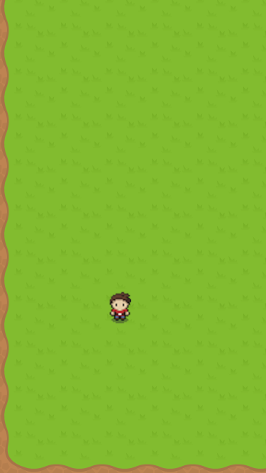
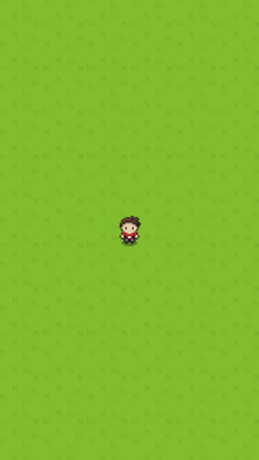
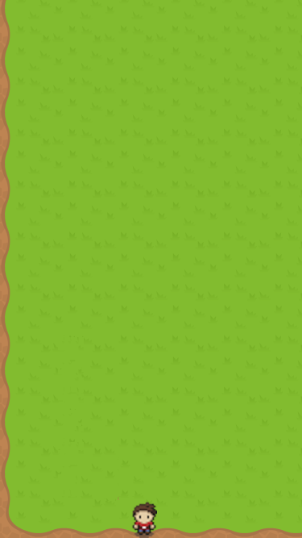

# Imagine Engine Tutorial #2: Walkabout

Welcome to the second Imagine Engine tutorial, in which we will dive a bit deeper into some of the engine's features - including sprite sheets, camera control, constraints and how to make a movable character.

In this tutorial, we're going to build a simple game in which a character can be moved around by clicking. Let's call it *Walkabout*. The end result will look like this:



## Setup

Before beginning this tutorial, make sure you have already completed the first one - [Asteroid Blaster](https://github.com/JohnSundell/ImagineEngine/tree/master/Documentation/Tutorials/1-AsteroidBlaster) - which will show you how to get started with the engine and introduce you to its basic concepts.

ℹ️ *This tutorial requires version 0.3.0 or later of Imagine Engine, so make sure you have an up-to-date version by pulling the latest master from your cloned directory.*

To code along this tutorial, open its playground workspace, which contains Imagine Engine as well as the graphics that we'll be using:

```
open ImagineEngine/Documentation/Tutorials/2-Walkabout/Walkabout.xcworkspace
```

You should now have an empty playground open. Hit ⌘+B to compile Imagine Engine for iOS.

Ready? Let's make a game! 🚀

## Setting the scene

Just like in the first tutorial, we'll start by creating a `Scene` subclass for our game and then displaying it using a `GameViewController` as the playground's live view:

```swift
import ImagineEngine

class WalkaboutScene: Scene {

}

let sceneSize = Size(width: 768, height: 768)
let scene = WalkaboutScene(size: sceneSize)
PlaygroundPage.current.liveView = GameViewController(scene: scene)
```

Note above that we make the scene a bit larger this time, to give our character more space to walk, and so that we can try out moving the scene's camera.

Open the playground's assistant editor (press ⌥+⌘+Enter) and you should now see an empty black rectangle, which is our scene being displayed.

## On solid ground

Lets fill that darkness with some ground! Just like in the first tutorial, we'll use a `Block` to add ground to our scene, but this time we'll use a sprite sheet instead of using a folder with separate textures. In game development, a sprite sheet is a single image that contains multiple textures. Imagine Engine supports both using separate image files and sprite sheets for textures.

We'll create a new `Block` and use the initializer that takes a `spriteSheetName`, for which we'll pass `Ground` (if you look in the playground's `Resources` folder, you'll see the sprite sheet - which is called `Ground@2x.png`). We'll use the size and center of the scene to make the block fill the entire scene.

```swift
class WalkaboutScene: Scene {
    override func setup() {
        let ground = Block(size: size, spriteSheetName: "Ground")
        ground.position = center
        add(ground)
    }
}
```

*Like in the first tutorial, we override our scene's `setup` method to setup our game. All the rest of the code in this tutorial will also be added to that same method.*

You should now see a scene filled with grass in the playground's live view 👍


## Adding the player

Next up, let's add our player, also at the center of the scene. Since the player will be an active, animated object, we'll use the `Actor` type:

```swift
let player = Actor()
player.position = center
add(player)
```

In the first tutorial, all of our actors only rendered a single animation (except for when exploding), but this time we'll use 5 different animations (one for idle, and 4 for walking in each direction). To enable us to easily refer to animations without having to include long file paths, we'll use a `textureNamePrefix`, that tells Imagine Engine that each time a texture will be loaded for the player, a certain prefix should be used. In this case, we'll use `"Player/"`, to match the `Player` folder in our playground's `Resouces` folder:

```swift
player.textureNamePrefix = "Player/"
```

Finally, let's make the player play its idle animation (note that we can now simply refer to the animation as `"Idle"` instead of having to use the full file path):

```swift
let idleAnimation = Animation(name: "Idle", frameCount: 1, frameDuration: 1)
player.animation = idleAnimation
```

You should now see the player standing at the center of the scene 🙋‍♂️



## Walking about

Now it's time to get the player moving! Every time the scene is tapped, we want to move the player to that location. Let's start by observing the scene's `clicked` event:

```swift
events.clicked.observe { scene, point in

}
```

We'll be moving our player in two steps. First, we'll move the player horizontally, then vertically. To calculate the duration for both of those steps, we'll use the absolute difference between the player's current position and the target position, divided by a speed constant:

```swift
let speed: Metric = 100
let horizontalTarget = Point(x: point.x, y: player.position.y)
let horizontalDuration = TimeInterval(abs(player.position.x - point.x) / speed)
let verticalTarget = Point(x: point.x, y: point.y)
let verticalDuration = TimeInterval(abs(player.position.y - point.y) / speed)
```

To get the player to first move to the `horizontalTarget`, then to the `verticalTarget`, we'll use the `move()` method on our actor, which we will then chain by calling `then()` on the returned `ActionToken`, like this:

```swift
player.move(to: horizontalTarget, duration: horizontalDuration)
      .then(player.move(to: verticalTarget, duration: verticalDuration))
      .then(player.playAnimation(idleAnimation))
```

*Note above that we include a final step to make the player play the idle animation. This is because we'll soon add walking animations too, and we want to go back to the idle one as soon as the move finishes.*

With the above code inserted into the click event's closure, we'll get our player moving, but weird things will start to happen if the scene is repeatedly clicked. This is because the player will perform multiple move actions simultaneously, which will make things very confusing. To fix this, we're going to cancel any current move action as soon as a new one is started. To do that, we're going to create a variable outside of the event closure to keep track of the current `ActionToken` for moving:

```swift
var moveToken: ActionToken?
```

Then, inside of the event closure, the first thing we'll do is to cancel any current move action:

```swift
moveToken?.cancel()
```

Finally, when performing the new action chain, we'll save the returned `ActionToken` into our `moveToken` variable:

```swift
moveToken = player.move(to: horizontalTarget, duration: horizontalDuration)
                  .then(player.move(to: verticalTarget, duration: verticalDuration))
                  .then(player.playAnimation(idleAnimation))
```

*Imagine Engine returns tokens for all asynchronous operations, or actions that take place over time. These tokens both enable you to cancel an ongoing action or operation, but also to perform chaining and use other more powerful features.*

With all of the above in place, here's what our final click handling & moving code looks like:

```swift
var moveToken: ActionToken?

events.clicked.observe { scene, point in
    moveToken?.cancel()

    let speed: Metric = 100
    let horizontalTarget = Point(x: point.x, y: player.position.y)
    let horizontalDuration = TimeInterval(abs(player.position.x - point.x) / speed)
    let verticalTarget = Point(x: point.x, y: point.y)
    let verticalDuration = TimeInterval(abs(player.position.y - point.y) / speed)

    moveToken = player.move(to: horizontalTarget, duration: horizontalDuration)
                      .then(player.move(to: verticalTarget, duration: verticalDuration))
                      .then(player.playAnimation(idleAnimation))
}
```

You should now be able to move the player around by clicking the scene in the playground's live view 🏃

## Adding walking animations

Our player is moving, but it looks more like flying than walking. So let's do something about that. What we want to do is to update the player's animation whenever its position changes, based on which direction the player was moved in.

We'll start by observing the player's `moved` event, and calculating a `directionName` based on the difference between the old and new position, like this:

```swift
player.events.moved.addObserver(self) { scene, player, positions in
    let directionName: String
    
    if positions.new.x < positions.old.x {
        directionName = "Left"
    } else if positions.new.x > positions.old.x {
        directionName = "Right"
    } else if positions.new.y > positions.old.y {
        directionName = "Down"
    } else {
        directionName = "Up"
    }
}
```

Next, we'll update the player's animation. Again, we'll use a sprite sheet to be able to load a single texture and use it for the entire animation. In our playground's `Resources` folder, we have sprite sheets for all directions contained in a `Walking` folder, so let's refer to either of those:

```swift
player.animation = Animation(
    spriteSheetNamed: "Walking/\(directionName)",
    frameCount: 4,
    rowCount: 1,
    frameDuration: 0.15
)
```

*Sprite sheets can be two-dimensional and have multiple rows. But the ones we are using in this tutorial are quite simple, and only have a single row - hence the `rowCount: 1` above.*

Finally, every time the player is moved, we want the camera to follow. To do that is super simple, all we have to do is set the camera's position to match the player's, inside of our movement observation closure:

```swift
scene.camera.position = positions.new
```

And with that, we have a walking player that the camera automatically follows in our scene! 🎉

## Constraints

Our game is almost complete, but it has a little problem. Right now, both the player and the camera can be moved outside of the scene, into the darkness. That's not very nice, but thankfully it's very easy to fix.

Imagine Engine has a simple but powerful constraints system built-in. Similar to how Auto Layout works, it enables you to assign constraints to objects to prevent them from moving to certain locations. For this tutorial, we'll simply constrain both the player and the camera to the scene, so that they can't move outside of it. Add the following at the end of our scene's `setup` method:

```swift
player.constraints = [.scene]
camera.constrainedToScene = true
```

Now, if you move to the edge of the scene, both the camera and the player will stop:



Now our game is fully complete and we have a simple game where a player can freely walk around in a 2D scene! 😀

## Summary

Congratulations, you just built your second game using Imagine Engine! 👍 Let's quickly recap what we've gone through in this tutorial:

- Using sprite sheets to render blocks and actor animations using a single texture.
- Using a `textureNamePrefix` to easily load textures for animations.
- Moving a character by chaining actions, and be able to cancel them.
- Moving the scene's camera.
- Observing movement and playing walking animations.
- Using constraints to prevent objects from moving out of the scene.

Hope you enjoyed this tutorial! If you have any questions, feedback or suggestions on how to make this tutorial better, feel free to [open an issue](https://github.com/JohnSundell/ImagineEngine/issues/new).

Thanks for reading and check back soon for more Imagine Engine documentation & tutorials! 🚀

---

[You can find all the code used in this tutorial here](https://github.com/JohnSundell/ImagineEngine/blob/master/Documentation/Tutorials/2-Walkabout/FinalCode.swift).

The graphics used in this tutorial were found at [OpenGameArt.org](https://opengameart.org/), specifically:

- [Ground, from Kenney's "RPG Pack"](https://opengameart.org/content/rpg-pack-base-set).
- [Player, from ArMM1998's "Zelda-like Tilesets and Sprites"](https://opengameart.org/content/zelda-like-tilesets-and-sprites)