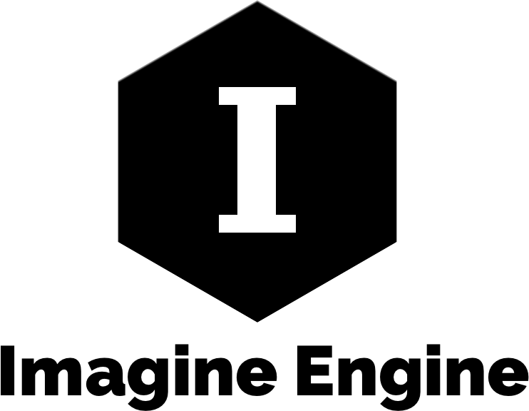

<p align="center">
    
</p>

<p align="center">
    <a href="https://dashboard.buddybuild.com/apps/59e21f30b84107000143844a/build/latest?branch=master">
        
    </a>
    
    <a href="https://cocoapods.org/pods/ImagineEngine">
        
    </a>
    <a href="https://github.com/Carthage/Carthage">
        
    </a>
    <a href="https://twitter.com/johnsundell">
        
    </a>
</p>

Welcome to **Imagine Engine**, an ongoing project that aims to create a fast, high-performace Swift 2D game engine for Apple's platforms that is also a joy to use. While there are still ways to go, things to fix and new capabilities to add, you are invited to participate in this new community to build a tool with an ambitious but clear goal - to enable you to easily build any game that you can imagine.

## Fast Core Animation-based rendering

Imagine Engine uses Core Animation as its rendering backend - just like Apple's UI frameworks like UIKit and AppKit does. By leveraging the power of Core Animation's hardware accelerated 2D rendering capabilities, Imagine Engine is able to push lots of pixels onto the screen at the same time. That means more objects, more effects and less restrictions when designing your games.

## An easy to use API

Besides its goal of being blazingly fast at rendering & updating your games, Imagine Engine aims to provide an easy to use API that anyone can learn - regardless of game development experience. More APIs will be added over time, but the engine already features a core set of features that we together can build new capabilities on top of.

Here's what's in Imagine Engine today:

🌃 **Scenes**

Scenes are what you use to present your game content. A scene can be a level, a menu or a "Game over" screen. You can easily switch the active scene of a game. Here's how you can create a scene with a blue background color:

```swift
let scene = Scene(size: Size(width: 500, height: 300))
scene.backgroundColor = .blue
game.scene = scene
```

🎭 **Actors**

Actors are what will make up most of the active objects in any game. They are movable, animatable, can handle collisions and much more. Here's an example of how you can create a player that renders a "Running" animation, and constantly moves to the right:

```swift
let player = Actor()
player.animation = Animation(name: "Running", frameCount: 5, frameDuration: 0.15)
player.velocity.dx = 50
scene.add(player)
```

📦 **Blocks**

Blocks enable you to easily tile textures together to form objects that can scale nicely to any size, without having to scale any texture. This is done by stiching together up to 9 different textures to form a block of textures rendered side by side. Here's how you can easily create a block from a folder named "Platform" that contains the textures that should be stiched together:

```swift
let block = Block(size: Size(width: 300, height: 300), textureCollectionName: "Platform")
scene.add(block)
```

🅰️ **Labels**

Labels let you add text content to your game. They automatically resize to fit your text content (unless you don't want them to) and can be used to implement things like UI, score counters, etc. Here's an example of adding a label to a scene:

```swift
let label = Label(text: "Welcome to my game!")
label.position = scene.center
scene.add(label)
```

⚡️ **Events**

Events enable you to quickly script your games to drive your own logic. Imagine Engine's various objects contain built in events that can be used to observe whenever an object was moved, collided with something, etc. You can also define your own events that can be used to communicate between various parts of your code. Here's how you can observe whenever two actors collided with each other:

```swift
let player = Actor()
let enemy = Actor()

player.events.collided(with: enemy).observe {
    // Game over
}
```

🏃 **Actions**

Actions let you make objects do something over a period of time, for example moving, resizing, fading in and out etc. Imagine Engine contains a suite of built-in actions and also makes it easy for you to define your own. Here's how an actor can be moved over 3 seconds:

```swift
let actor = Actor()
scene.add(actor)
actor.move(byX: 200, y: 100, duration: 3)
```

🔌 **Plugins**

Instead of relying on subclassing and overriding methods, Imagine Engine is designed to be easily extended through plugins. This enables you to share code between different games, and create new open source projects that add new functionality to the engine. You can attach plugins to most of Imagine Engine's objects, here's an example of creating a plugin that creates a new actor everytime the scene is clicked or tapped:

```swift
class MyPlugin: Plugin {
    func activate(for scene: Scene, in game: Game) {
        scene.events.clicked.observe { scene in
            let actor = Actor()
            actor.position = scene.center
            scene.add(actor)
        }
    }
}
```

🕐 **Timelines**

Managing time and delayed events can sometimes be tricky in game development. Imagine Engine aims to make this a lot easier through its timeline API, that enables you to schedule single or repeated events in the future without having to worry about screen updates or if the game is paused. Here's how you can add an event to spawn a new enemy every 5 seconds:

```swift
scene.timeline.repeat(withInterval: 5) {
    let enemy = Actor()
    enemy.animation = Animation(name: "Enemy", frameCount: 5, frameDuration: 0.15)
    scene.add(enemy)
}
```

## Getting started

To get started, check out the [tutorials section](https://github.com/JohnSundell/ImagineEngine/tree/master/Documentation/Tutorials), which contains tutorials that will walk you through building your first Imagine Engine-powered games with very few lines of code. No previous game developer experience required!

## Platform support

- [X] 📱 iOS 9 or later
- [X] 🖥 macOS 10.12 or later
- [ ] 📺 tvOS

Imagine Engine currently supports iOS & macOS, with tvOS support coming soon. The API is completely platform agnostic, which lets you use the exact same game code for all of Apple's platforms - no more `#if`s needed!

## Join the project!

I've been working on this project on and off for a few years now. It's far from perfect (and probably never will be), but it's a start. I have now decided to share this code and this project with you - the amazing Swift community - and you are more then welcome to join in contributing by implementing new features, fixing bugs or just experimenting with and testing the engine. I love games, and will continue working on Imagine Engine together with the games I build using it. The first game - Revazendo - is currently in [public beta on TestFlight](http://www.revazendo.com), so feel free to join the beta if you want to see the engine in action.

More documentation, contribution guidelines, starter tasks, issues and lots of other cool things will be coming up within the next couple of weeks. So stay tuned! 👍

I can't wait to see what we'll be able to build togeher 😊

-- John

PS. Feel free to [contact me on Twitter](https://twitter.com/johnsundell), my DMs are open! 📬
